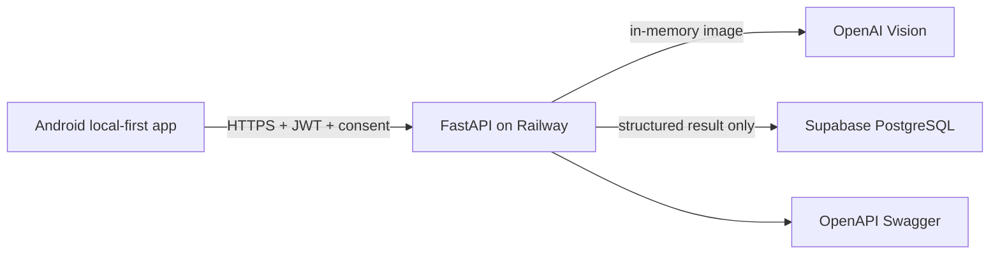

# Cloud Architecture

The Android app remains usable offline. Meal analysis is opt-in and uses HTTPS to the LifeTrack FastAPI API hosted on Railway. The API authenticates users with short-lived JWTs, keeps OpenAI credentials only in Railway environment variables, validates images in memory, returns structured estimates and never persists image bytes.

Supabase Auth owns users and JWTs. Supabase PostgreSQL stores structured meal-analysis results only, with RLS policies that restrict each record to `auth.uid()`. No Supabase Storage bucket is required because source images are never persisted. Future providers are isolated behind the analysis-provider port; barcode, label OCR, Health Connect, Samsung Health, cloud sync and Wear OS integrations should add independent adapters without coupling to Android domain models.

