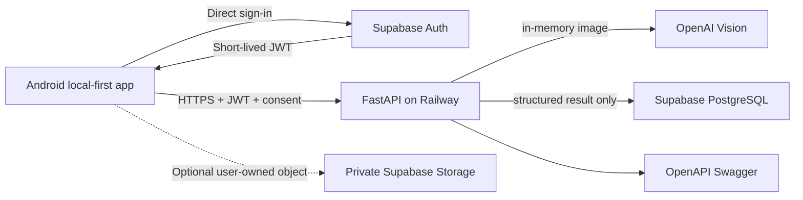

# Cloud Architecture

The Android app remains usable offline. Meal analysis is opt-in and uses HTTPS to the LifeTrack FastAPI API hosted on Railway. Android signs in directly with Supabase Auth; FastAPI only validates the resulting short-lived JWT. The API keeps OpenAI credentials only in Railway environment variables, validates images in memory, returns structured estimates and never persists uploaded image bytes.

Supabase Auth owns users and JWTs. Supabase PostgreSQL stores structured meal-analysis results, with RLS policies that restrict each record to `auth.uid()`. The optional private `meal-images` bucket is prepared for client-owned photos and restricts object paths to each user's UUID folder; FastAPI analysis still discards its upload and stores only a `photo_path` reference when supplied. Runtime database calls use the anon key plus the user's JWT, never a service-role key. Future providers remain isolated behind the analysis-provider port.

